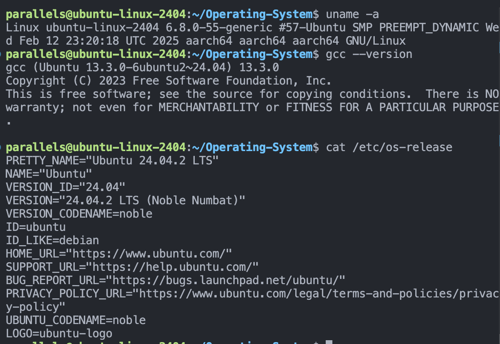
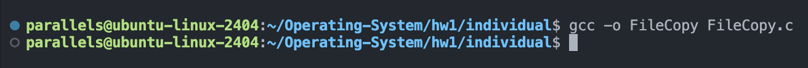
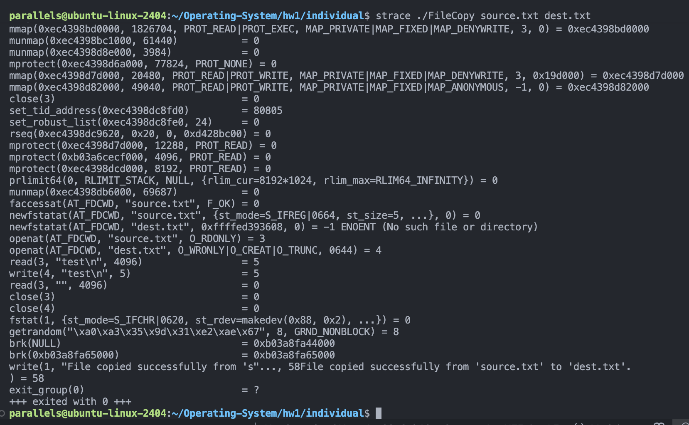
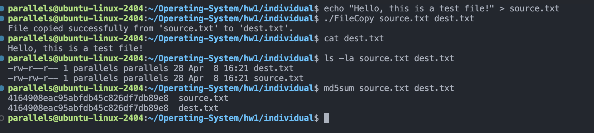
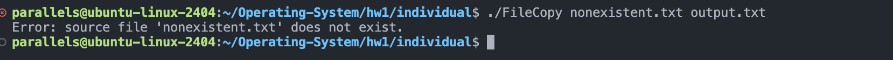
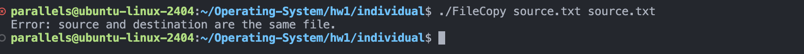
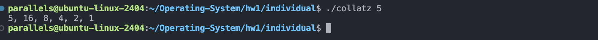
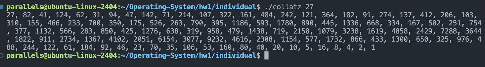
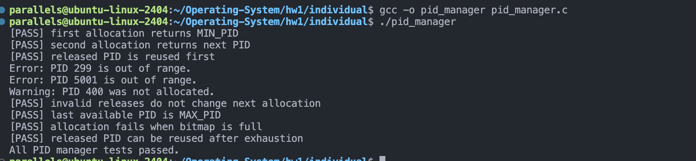
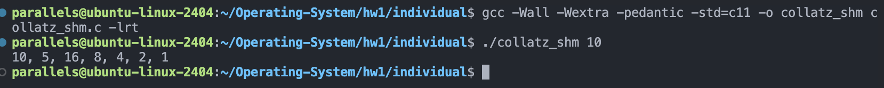

# HW1 Individual Assignments - Operating System Concepts

---

## Development Environment

### System Information


### Required Tools
- `gcc` - GNU C Compiler
- `make` - Build automation tool
- `strace` - System call tracing utility
- `gdb` - GNU Debugger (optional)

---

## Exercise 2.24: File Copy Program (FileCopy)

### Objective
Implement a file copying utility using POSIX file I/O system calls.

### Description
A file copying program that takes source and destination filenames as command-line arguments and copies the file contents with comprehensive error handling using POSIX system calls.

### Requirements
- Accept source and destination filenames as command-line arguments
- Validate input (check if source file exists and is a regular file)
- Prevent copying to the same filename
- Use `open()`, `read()`, `write()`, `close()` system calls
- Implement proper error handling with `perror()`
- Use buffer-based copying (e.g., 4KB chunks)
- Proper file descriptor cleanup

### Compilation & Execution
```bash
gcc -o FileCopy FileCopy.c
./FileCopy <source_file> <destination_file>
```


### System Call Tracing
```bash
strace ./FileCopy source.txt dest.txt
```


### Output Examples

**Test Case 1: Normal File Copying**
```bash
$ echo "Hello, this is a test file!" > source.txt
$ ./FileCopy source.txt dest.txt
$ cat dest.txt
Hello, this is a test file!
```


**Test Case 2: Error Handling - Source File Not Found**
```bash
$ ./FileCopy nonexistent.txt output.txt
FileCopy: nonexistent.txt: No such file or directory
```


**Test Case 3: Error Handling - Same Filename**
```bash
$ ./FileCopy source.txt source.txt
FileCopy: Cannot copy file to itself: source.txt
```


---

## Exercise 3.21: Collatz Conjecture

### Objective
Implement the Collatz conjecture (also known as the 3n+1 problem) sequence generator.

### Description
A program that computes the Collatz sequence by repeatedly applying rules until reaching 1:
- If the number is even, divide by 2
- If the number is odd, multiply by 3 and add 1

### Requirements
- Accept a positive integer as command-line argument
- Output the complete sequence
- Count and display the number of steps
- Handle edge cases (input 1, large numbers)

### Compilation & Execution
```bash
gcc -o collatz collatz.c
./collatz <positive_integer>
```


### Output Examples

**Test Case 1: Input 5**
```bash
$ ./collatz 5
5, 16, 8, 4, 2, 1
```


**Test Case 2: Input 27**
```bash
$ ./collatz 27
27, 82, 41, 124, 62, 31, 94, 47, 142, 71, 214, 107, 322, 161, 484, 242, 121, 364, 182, 91, 274, 137, 412, 206, 103, 310, 155, 466, 233, 700, 350, 175, 526, 263, 790, 395, 1186, 593, 1780, 890, 445, 1336, 668, 334, 167, 502, 251, 754, 377, 1132, 566, 283, 850, 425, 1276, 638, 319, 958, 479, 1438, 719, 2158, 1079, 3238, 1619, 4858, 2429, 7288, 3644, 1822, 911, 2734, 1367, 4102, 2051, 6154, 3077, 9232, 4616, 2308, 1154, 577, 1732, 866, 433, 1300, 650, 325, 976, 488, 244, 122, 61, 184, 92, 46, 23, 70, 35, 106, 53, 160, 80, 40, 20, 10, 5, 16, 8, 4, 2, 1
```


**Test Case 3: Input 1 (Edge Case)**
```bash
$ ./collatz 1
1
```


---

## Exercise 3.20: PID Manager (Optional)

### Objective
Implement a bitmap-based PID allocation and deallocation system.

### Description
A PID manager that uses a bitmap to track process identifiers from 300 to 5000. The system demonstrates memory-efficient PID allocation with reuse capabilities.

### Requirements
- Manage PID allocation from 300 to 5000
- Implement bitmap data structure for efficient tracking
- Support allocate and release operations
- Demonstrate PID reuse after release
- Implement allocate_map(), allocate_pid(), release_pid(), deallocate_map()

### Compilation & Execution
```bash
gcc -o pid_manager pid_manager.c
./pid_manager
```


---

## Exercise 3.22: Collatz with POSIX Shared Memory (Optional)

### Objective
Extend the Collatz conjecture implementation using POSIX shared memory for inter-process communication.

### Description
This program uses POSIX shared memory to enable parent-child process communication. The child process computes the Collatz sequence and writes it into shared memory, while the parent process waits and reads the result.

### API Functions Used
- `shm_open()` - Create/open shared memory object
- `ftruncate()` - Set size of shared memory
- `mmap()` - Memory mapping
- `wait()` - Parent process synchronization
- `munmap()` - Unmap memory
- `shm_unlink()` - Clean up shared memory

### Compilation & Execution
```bash
gcc -Wall -Wextra -pedantic -std=c11 -o collatz_shm collatz_shm.c -lrt
./collatz_shm <positive_integer>
```


---

## Notes
- All programs have been tested on the specified system environment
- Proper error handling is implemented for edge cases
- Source code includes inline comments for clarity
- Compile flags may vary depending on specific system requirements

---