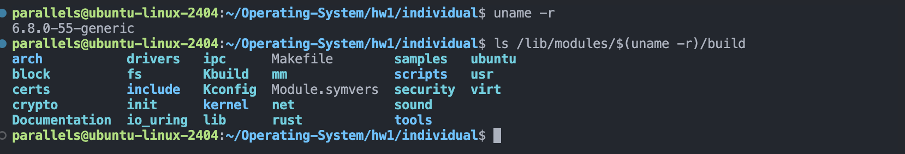
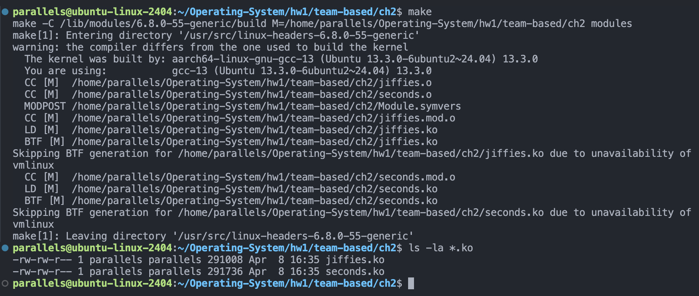
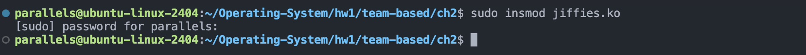
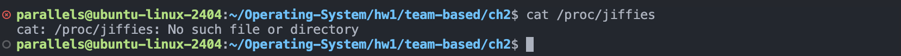
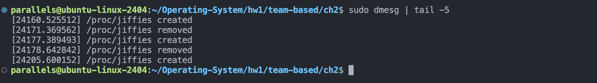
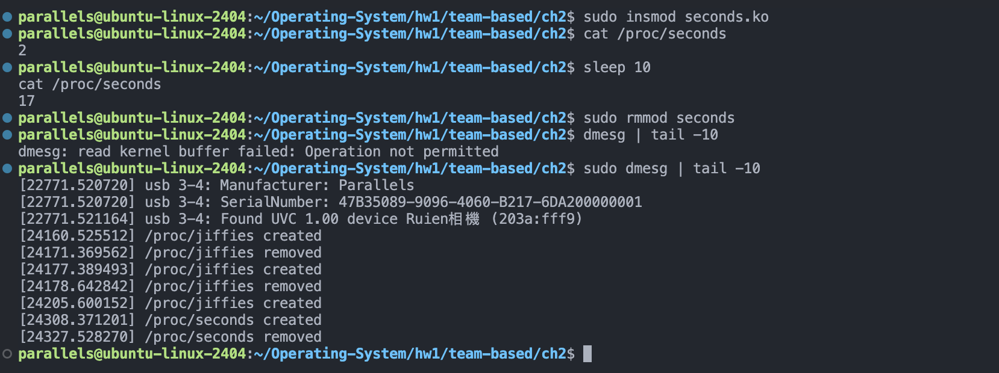
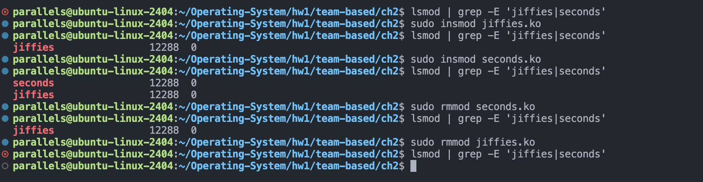
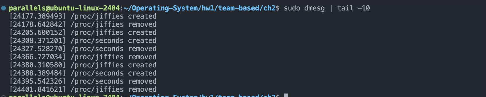

# HW1 Team-based Ch.2 - Linux Kernel Modules

## Development Environment

### System Requirements
- **OS**: Linux kernel 5.x or later
- **Kernel Headers**: Must install development headers for the kernel version
- **Build Tools**: make, gcc, module utilities

#### Install Kernel Development Environment
```bash
# Ubuntu/Debian
sudo apt-get install build-essential linux-headers-$(uname -r)

# Verify installation
uname -r
ls /lib/modules/$(uname -r)/build
```


---

## Project 1: Jiffies Module (/proc/jiffies)

### Objective
Design a kernel module that creates a `/proc/jiffies` file reporting the current value of jiffies.

### Description
- **jiffies** is a kernel internal variable used to track system time
- Increments each system clock interrupt
- This module exposes the current jiffies value through the `/proc` file system

### Key Kernel APIs
- `proc_create()` - Create proc file
- `proc_remove()` - Remove proc file
- `jiffies` - Kernel global variable
- `module_init()` / `module_exit()` - Module initialization and cleanup

### Compilation Guide

**Compile jiffies module individually**
```bash
make KDIR=/lib/modules/$(uname -r)/build M=$(pwd) modules
```

**Compile using Makefile**
```bash
cd /path/to/hw1/team-based/ch2
make
```


### Load and Test

**Load module**
```bash
sudo insmod jiffies.ko
```


**Read /proc/jiffies file**
```bash
cat /proc/jiffies
```


**Unload module**
```bash
sudo rmmod jiffies
```


**Verify module removed (/proc/jiffies should not exist)**
```bash
cat /proc/jiffies    # Should show error
```




### Expected Output Example

```bash
$ cat /proc/jiffies
4294945823

$ cat /proc/jiffies
4294967101

$ cat /proc/jiffies
4294968523
```

---

## Project 2: Seconds Module (/proc/seconds)

### Objective
Design a kernel module that creates a `/proc/seconds` file reporting elapsed seconds since the kernel module was loaded.

### Description
- Calculate elapsed seconds using jiffies value and `HZ` rate
- `HZ` is the system clock interrupt frequency (typically 100, 250, or 1000 Hz)
- Formula: elapsed seconds = jiffies / HZ

### Key Kernel APIs
- `proc_create()` - Create proc file
- `proc_remove()` - Remove proc file
- `jiffies` - Kernel global variable
- `HZ` - Kernel-defined constant
- `module_init()` / `module_exit()` - Module initialization and cleanup

### Compilation Guide

**Compile both modules using Makefile**
```bash
cd /path/to/hw1/team-based/ch2
make
```


### Load and Test

**Load module**
```bash
sudo insmod seconds.ko
```

**Read immediately after loading (initial read)**
```bash
cat /proc/seconds
```

**Wait 10 seconds, then read again**
```bash
sleep 10
cat /proc/seconds
```

**Unload module**
```bash
sudo rmmod seconds
```


### Expected Output Example

```bash
$ sudo insmod seconds.ko
$ cat /proc/seconds
0

[Wait 10 seconds]
$ cat /proc/seconds
10

[Wait 20 seconds]
$ cat /proc/seconds
30

[Wait 30 seconds]
$ cat /proc/seconds
60

$ sudo rmmod seconds
```

---

## Kernel Module Maintenance Commands

### View Loaded Modules
```bash
lsmod                              # List all loaded modules
lsmod | grep -E 'jiffies|seconds' # Search for specific modules
```


### Check Kernel Information
```bash
dmesg              # View all kernel messages
dmesg | tail -10   # View last 10 lines
```


### Remove Modules
```bash
sudo rmmod jiffies  # Remove jiffies module
sudo rmmod seconds  # Remove seconds module
```


### Clean Compiled Files
```bash
make clean
```

---

## Complete Workflow Examples

### Test Jiffies Module
```bash
# Change to directory
cd /home/parallels/Operating-System/hw1/team-based/ch2

# Compile
make

# Load module
sudo insmod jiffies.ko

# Read multiple times (verify value changes)
cat /proc/jiffies
sleep 1
cat /proc/jiffies
sleep 1
cat /proc/jiffies

# View kernel log
dmesg | tail -5

# Unload module
sudo rmmod jiffies

# Verify module removed
cat /proc/jiffies    # Should show "No such file or directory"

# Cleanup
make clean
```

### Test Seconds Module
```bash
# Compile
make

# Load module
sudo insmod seconds.ko

# Record initial time
echo "Module loaded at $(date)"
cat /proc/seconds

# Wait 30 seconds and read
sleep 30
cat /proc/seconds

# Wait another 30 seconds
sleep 30
cat /proc/seconds

# Unload module
sudo rmmod seconds

# Cleanup
make clean
```

---

## Screenshot Checklist

| Item | Screenshots Required | Notes |
|------|-------------|------|
| System Environment | `uname -r` and `ls /lib/modules/$(uname -r)/build` | Verify kernel development environment |
| Compile jiffies | Complete `make` output + `ls -la *.ko` | Verify successful compilation |
| Load jiffies | Output of `sudo insmod jiffies.ko` | Module loaded successfully |
| Read jiffies | Multiple executions of `cat /proc/jiffies` | Show value changing |
| jiffies Kernel Log | Output of `dmesg \| tail -5` | View module initialization info |
| Unload jiffies | Output of `sudo rmmod jiffies` | Module unloaded successfully |
| jiffies Removal Verification | `cat /proc/jiffies` showing error | Verify /proc file removed |
| Compile seconds | Complete `make` output + `ls -la *.ko` | Verify successful compilation |
| Load seconds | Output of `sudo insmod seconds.ko` | Module loaded successfully |
| Initial seconds | Read `/proc/seconds` immediately after loading | Initial value should be near 0 |
| Incremental seconds | Multiple reads (10, 30, 60 seconds apart) | Show seconds incrementing |
| seconds Kernel Log | Output of `dmesg \| tail -10` | View module initialization info |
| Unload seconds | Output of `sudo rmmod seconds` | Module unloaded successfully |
| seconds Removal Verification | `cat /proc/seconds` showing error | Verify /proc file removed |
| Module List | `lsmod \| grep -E 'jiffies\|seconds'` before and after | Verify module state changes |

---

## Troubleshooting

### Problem: Permission denied when executing insmod
**Solution**: Ensure using `sudo` when executing insmod
```bash
sudo insmod jiffies.ko
```

### Problem: Module jiffies not found
**Solution**: Ensure running make in ch2 directory and successful .ko file generation
```bash
cd /home/parallels/Operating-System/hw1/team-based/ch2
make
ls -la *.ko
```

### Problem: Cannot open /proc/jiffies: No such file or directory
**Solution**: Ensure module is properly loaded
```bash
sudo lsmod | grep jiffies
sudo insmod jiffies.ko  # If not listed, reload
```

### Problem: Error creating proc entry
**Solution**: Check if /proc directory is writable or view kernel log
```bash
dmesg | tail -20
```

---

## Important Notes
- All module operations require root privileges (use `sudo`)
- Kernel development headers required for module compilation
- Different kernel versions may require different compilation flags
- Check `dmesg` for detailed error information
- /proc files automatically removed after module unload