# HW1 Team-based Ch.3 - Unix Shell Implementation

## Development Environment

### System Requirements
- **OS**: Linux
- **Compiler**: GCC 9.x or later
- **C Standard**: C99 or later
- **Build Tool**: make

#### Verify Compilation Environment
```bash
gcc --version
make --version
```
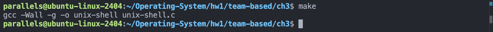

---

## Project 1: Unix Shell Implementation (unix-shell)

### Objective
Design a C program that serves as a shell interface, accepting user commands and executing each command in a separate process.

### Description
Implement a Unix Shell program that supports the following core functionality:
- Read user-input commands
- Execute commands in child processes
- Support command-line argument parsing
- Implement input/output redirection
- Implement pipe communication for inter-process communication
- Create a command history feature

### Required System Calls
- **fork()** - Create a new process
- **exec()** - Execute a new program (use execvp() or execve())
- **wait()** - Wait for child process to complete
- **dup2()** - Redirect file descriptors (for input/output redirection)
- **pipe()** - Create a pipe for inter-process communication

### Assignment Structure

#### I. Overview
- Shell architecture and basic workflow
- Command parsing and argument extraction
- Process creation and management fundamentals

#### II. Executing Commands in Child Processes
- Create child processes using fork()
- Execute commands in child processes using exec()
- Parent process waits for child process completion using wait()
- Handle command execution and return values

#### III. Command History Feature
- Maintain a list of executed commands
- Support viewing command history
- Support re-executing history commands (if implemented)
- Manage history with size limitations

#### IV. Input/Output Redirection
- Support output redirection `>`
- Support input redirection `<`
- Support append redirection `>>` (optional)
- Use dup2() to redirect standard I/O

#### V. Communication via Pipes
- Support pipe operation `|`
- Establish pipe communication between two processes
- Connect multiple commands via pipes (optional)
- Use pipe() for inter-process communication

---

## Compilation Guide

### Compile using Makefile
```bash
cd /home/parallels/Operating-System/hw1/team-based/ch3
make
```


### Manual Compilation
```bash
gcc -Wall -g -o unix-shell unix-shell.c
```

---

## Running and Testing

### Launch the Shell
```bash
./unix-shell
```

### Part II: Basic Command Testing

**Test Case 1: List Files**
```bash
-shell>ls
-shell>ls -l
-shell>ls -la
```
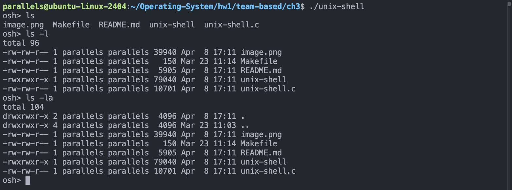

**Test Case 2: Display Text**
```bash
-shell>echo "Hello, World!"
```


**Test Case 3: View File Contents**
```bash
-shell>cat unix-shell.c
-shell>cat Makefile
```
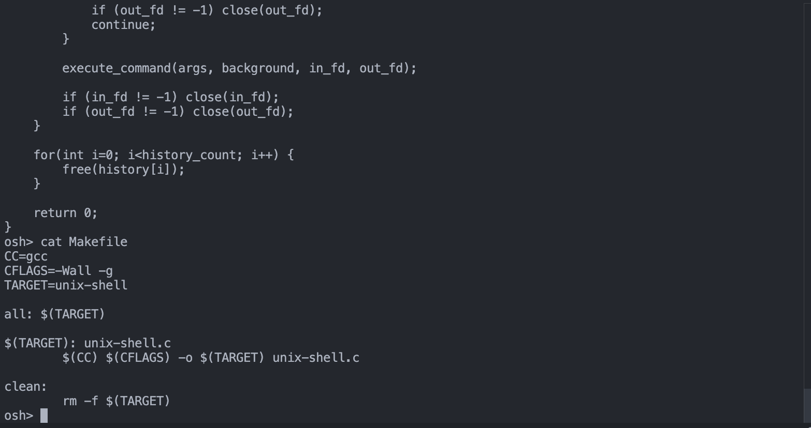

**Test Case 4: Show Current Directory**
```bash
-shell>pwd
```


---

### Part III: Command History Testing

**Test Case 1: Execute Multiple Commands to Build History**
```bash
-shell>ls
-shell>pwd
-shell>echo "test"
-shell>ls -l
```
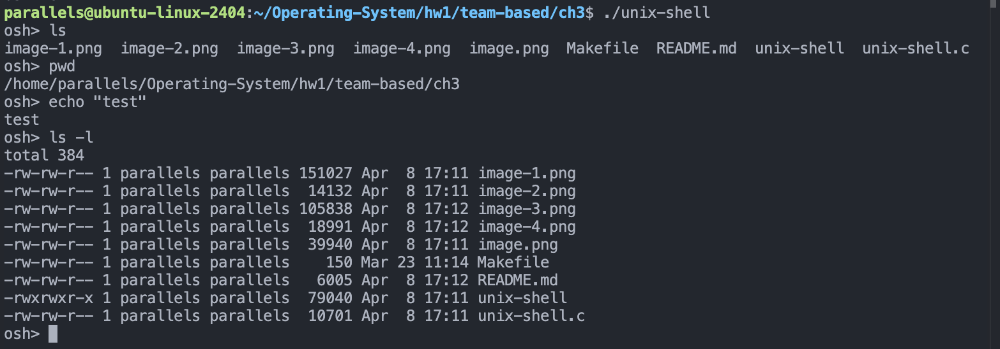

**Test Case 2: View Command History**
```bash
-shell>history
```
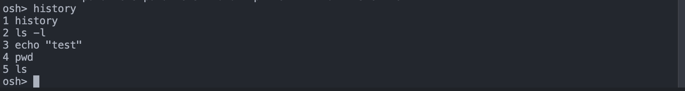

**Test Case 3: Re-execute History Commands**
```bash
-shell>!1
-shell>!2
-shell>!!
```
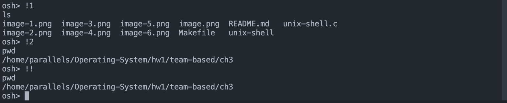

---

### Part IV: Input/Output Redirection Testing

**Test Case 1: Output Redirection `>`**
```bash
-shell>echo "Hello" > output.txt
-shell>cat output.txt
Hello
-shell>ls > file_list.txt
-shell>cat file_list.txt
```
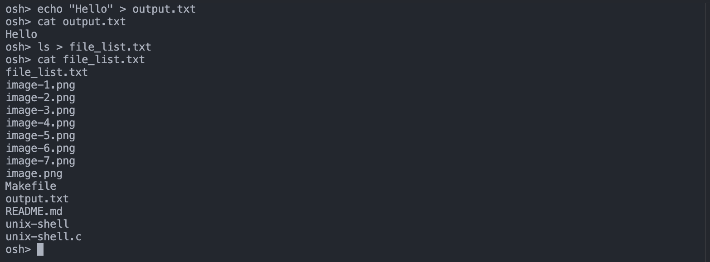

**Test Case 2: Input Redirection `<`**
```bash
-shell>wc < output.txt
-shell>cat < output.txt
Hello
```
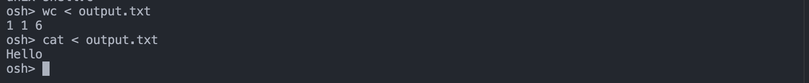

**Test Case 3: Append Redirection `>>` (Optional)**
```bash
-shell>echo "Line 1" > data.txt
-shell>echo "Line 2" >> data.txt
-shell>cat data.txt
Line 1
Line 2
```
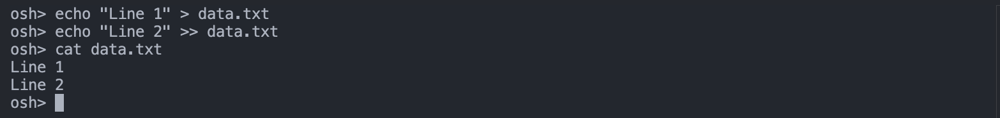

**Test Case 4: Combined Usage**
```bash
-shell>echo "test line" > temp.txt
-shell>cat < temp.txt
-shell>wc < temp.txt
```
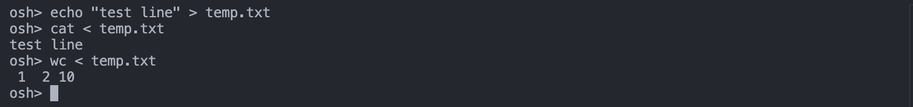

---

### Part V: Pipe Communication Testing

**Test Case 1: Simple Pipe**
```bash
-shell>ls | wc -l
-shell>cat unix-shell.c | grep "int"
-shell>cat unix-shell.c | wc -l
```
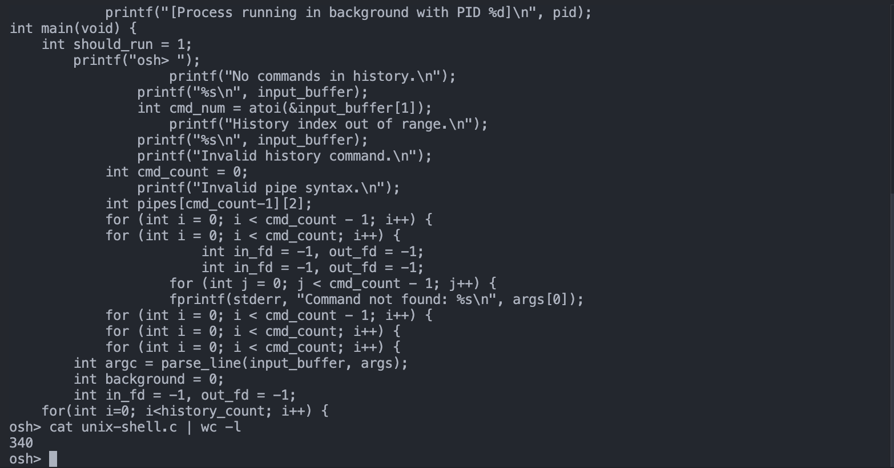

**Test Case 2: Multiple Pipe Connections**
```bash
-shell>cat unix-shell.c | grep "main" | wc -l
-shell>ls -l | grep "unix-shell"
```
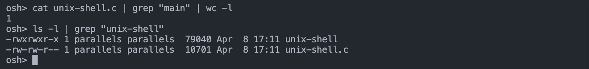

**Test Case 3: Pipe with Redirection**
```bash
-shell>cat unix-shell.c | grep "int" > int_lines.txt
-shell>cat < Makefile | wc -l
```
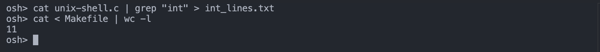

**Test Case 4: Complex Command Combinations**
```bash
-shell>cat unix-shell.c | grep "void" | grep -v "^//"
-shell>find . -name "*.c" | wc -l
```
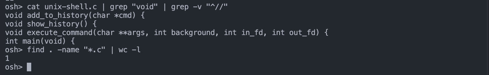

---

## Cleanup

### Remove Compiled Files
```bash
make clean
```

### Recompile
```bash
make clean
make
```

---

## Complete Workflow Example

```bash
# Change to directory
cd /home/parallels/Operating-System/hw1/team-based/ch3

# Compile
make

# Verify successful compilation
ls -la unix-shell

# Launch shell
./unix-shell

# Execute commands in shell
-shell>ls
-shell>pwd
-shell>echo "Testing shell"
-shell>cat Makefile
-shell>exit

# Cleanup
make clean
```

## Troubleshooting

### Problem: Compilation error "gcc: command not found"
**Solution**: Install GCC compiler
```bash
sudo apt-get install build-essential
```

### Problem: Makefile error
**Solution**: Ensure Makefile uses Tab instead of spaces
```bash
cat -A Makefile  # Display hidden characters
```

### Problem: Executable permission issue
**Solution**: Add execute permission
```bash
chmod +x unix-shell
```

### Problem: Shell unresponsive or cannot execute commands
**Solution**: 
1. Verify correct command syntax: `./unix-shell`
2. Check if full path needed: `/bin/ls` instead of `ls`
3. Review source code for initialization issues

### Problem: Command output not displayed
**Solution**: Check if standard output and error are properly redirected

---

## Important Notes
- This implementation is a simplified educational version
- Actual Unix Shells (like bash) are much more complex
- Start testing with simple commands before advancing to complex ones
- Use `strace ./unix-shell` to trace system calls
- The core `fork()`, `execvp()`, `wait()` calls are fundamental to shell implementation