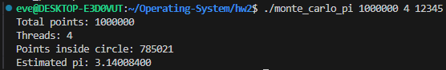
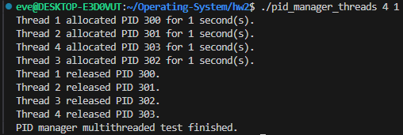
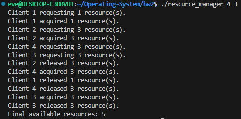

# Homework 2 Submission

## Contents
- Individual programming problem: Exercise 4.24 Monte Carlo Pi
- Individual optional programming problem: Exercise 4.28 Multithreaded PID Manager Test
- Individual programming problem: Exercise 6.33 Resource Manager Race Condition
- Team-based programming projects: see [team/README.md](team/README.md)

## Exercise 4.24 - Monte Carlo Pi

### Program Description
This program estimates pi with the Monte Carlo technique. It creates multiple POSIX threads, and each thread generates random points inside the square from `(-1, -1)` to `(1, 1)`. Points whose distance from the origin is less than or equal to `1` are counted as inside the circle.

The estimate is calculated with:

```text
pi = 4 * points_inside_circle / total_points
```

The worker threads add their local counts to a global variable protected by a mutex.

### Compilation & Execution
```bash
gcc -Wall -Wextra -pedantic -std=c11 -o monte_carlo_pi monte_carlo_pi.c -pthread
./monte_carlo_pi <number_of_points> <number_of_threads> [seed]
```

### Examples
```bash
./monte_carlo_pi 1000000 4
./monte_carlo_pi 1000000 4 12345
```

The optional seed makes the random result repeatable for testing.

### Execution Result Screenshot


### Features Implemented
- Monte Carlo estimation of pi
- Multithreaded point generation with POSIX pthreads
- Work divided across the requested number of threads
- Per-thread random seed using `rand_r()`
- Global result protected by a mutex
- Command-line argument validation
- Optional deterministic seed for repeatable runs

## Optional Exercise 4.28 - Multithreaded PID Manager Test

### Program Description
This program modifies the PID manager from Exercise 3.20 so it can be tested by multiple threads. Each thread:

1. Requests a PID.
2. Sleeps for a random number of seconds.
3. Releases the PID.

The PID bitmap is shared by all threads, so calls to `allocate_pid()` and `release_pid()` are protected by a mutex.

### Compilation & Execution
```bash
gcc -Wall -Wextra -pedantic -std=c11 -o pid_manager_threads pid_manager_threads.c -pthread
./pid_manager_threads [thread_count] [max_sleep_seconds]
```

### Examples
```bash
./pid_manager_threads
./pid_manager_threads 100 3
./pid_manager_threads 10 1
```

### Execution Result Screenshot


## Exercise 6.33 - Resource Manager Race Condition

### Written Answers

**(a) Data involved in the race condition:**  
The shared variable `available_resources`.

**(b) Location of the race condition:**  
The race occurs in both `decrease_count()` and `increase_count()` because multiple threads can read and update `available_resources` at the same time. In `decrease_count()`, the check `available_resources < count` and the update `available_resources -= count` must be atomic with respect to other threads.

**(c) Fixed solution:**  
The implementation in `resource_manager.c` protects `available_resources` with a mutex. It also uses a condition variable so a thread requesting more resources than are currently available will block until another thread returns resources.

### Compilation & Execution
```bash
gcc -Wall -Wextra -pedantic -std=c11 -o resource_manager resource_manager.c -pthread
./resource_manager [thread_count] [max_request]
```

### Examples
```bash
./resource_manager
./resource_manager 8 3
```

`max_request` cannot exceed `MAX_RESOURCES`, which is set to `5`.

### Execution Result Screenshot


## Team-Based Programming Projects

The team-based programming projects are documented separately in [team/README.md](team/README.md).
