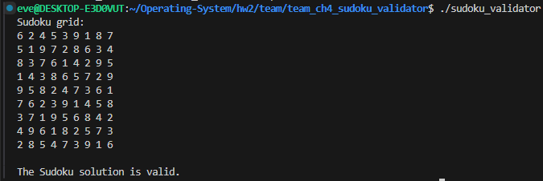
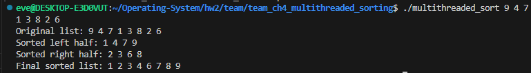
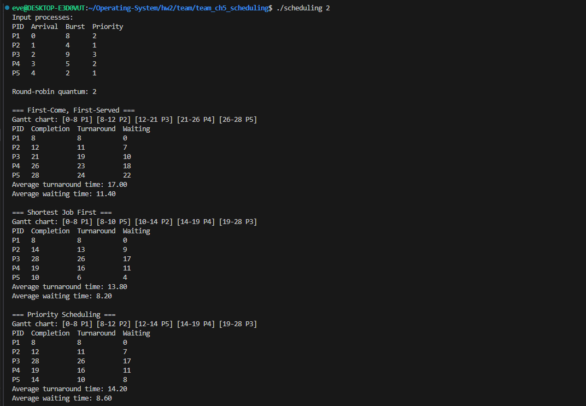
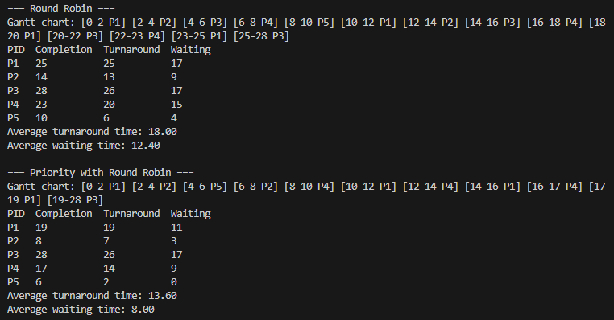

# Homework 2 Team-Based Programming Projects

The team-based projects are separated into their own directories. Although the assignment asks the team to choose one Chapter 4 project, both Chapter 4 options are included here.

## Chapter 4 - Sudoku Solution Validator

### Compilation & Execution
```bash
cd team_ch4_sudoku_validator
gcc -Wall -Wextra -pedantic -std=c11 -o sudoku_validator sudoku_validator.c -pthread
./sudoku_validator
```

### Files
- `team_ch4_sudoku_validator/sudoku_validator.c`
- `team_ch4_sudoku_validator/README.md`

### Execution Result


## Chapter 4 - Multithreaded Sorting

### Compilation & Execution
```bash
cd team_ch4_multithreaded_sorting
gcc -Wall -Wextra -pedantic -std=c11 -o multithreaded_sort multithreaded_sort.c -pthread
./multithreaded_sort
./multithreaded_sort 9 4 7 1 3 8 2 6
```

### Files
- `team_ch4_multithreaded_sorting/multithreaded_sort.c`
- `team_ch4_multithreaded_sorting/README.md`

### Execution Result


## Chapter 5 - Scheduling Algorithms

### Compilation & Execution
```bash
cd team_ch5_scheduling
gcc -Wall -Wextra -pedantic -std=c11 -o scheduling scheduling.c
./scheduling
./scheduling 3
```

### Files
- `team_ch5_scheduling/scheduling.c`
- `team_ch5_scheduling/README.md`

### Execution Result

